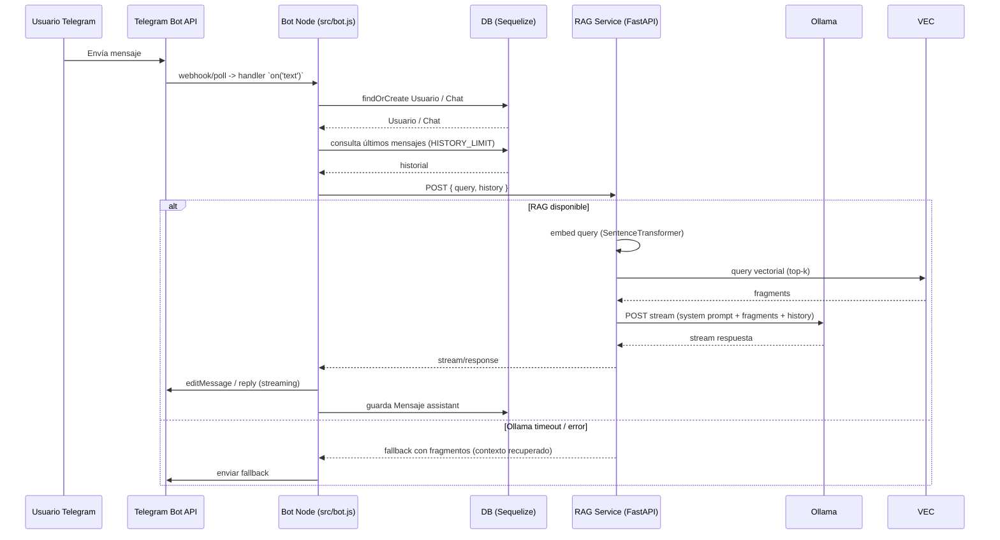

# ESPECIFICACIÓN Y DIAGRAMAS DEL SISTEMA

> USO PARA MODELOS DE IA: Incluye diagramas Mermaid y una especificación textual nodo-a-nodo. Renderiza los bloques Mermaid o usa la especificación para recrear los diagramas en otras herramientas.

## 1. Diagrama de Arquitectura Global

```mermaid
graph TD
  U[Usuario Telegram]
  TA[Telegram Bot API]
  B[Servidor Backend (Node.js)\n`src/index.js`, `src/bot.js`]
  DB[(Base de Datos Relacional)\nPostgres / SQLite fallback]
  RAG[Pipeline RAG (FastAPI)\n`ai-service/api.py`]
  DOCS[(Base de Conocimiento)\nMarkdown files (`ai-service/docs/`, `docs/`)]
  VEC[Vector DB (ChromaDB)\n`ai-service/chroma_db/`]
  OLL[Servidor Ollama]
  FRONT[Frontend (DEPRECADO / PENDIENTE DE REMOCIÓN)]

  U -->|mensaje| TA
  TA -->|webhook/poll| B
  B -->|guarda/lee historial| DB
  B -->|POST query| RAG
  RAG -->|consulta| VEC
  RAG -->|llama| OLL
  RAG -->|lee| DOCS
  VEC -->|persistencia| DOCS
  FRONT -.->|acoplamiento histórico| B
  style FRONT fill:#f9d5d3,stroke:#b55347,stroke-width:2

  classDef infra fill:#f3f4f6,stroke:#111827
  class B,RAG,VEC,DB,OLL infra
```

## 2. Diagrama de Secuencia: Ciclo de Vida del Mensaje



## 3. Diagrama de Flujo: Pipeline RAG

```mermaid
flowchart LR
  MD[Archivos Markdown (ai-service/docs/, docs/)] --> Parse[Extracción / Parsing]
  Parse --> Chunk[Chunking (ingest.py: chunk_size=800, overlap=150)]
  Chunk --> Embed[Vectorización (OllamaEmbeddings o Sentence-Transformers)]
  Embed --> Index[Indexación en ChromaDB (PersistentClient)]
  Index -->|consulta| RAGService[FastAPI `/chat`]
  RAGService -->|embed query| EmbedQuery[SentenceTransformer.encode]
  EmbedQuery --> VSearch[ChromaDB query top-k (k=6)]
  VSearch --> PromptBuilder[Construcción System Prompt (fragments concatenados)]
  PromptBuilder -->|POST stream| Ollama
  Ollama -->|stream| RAGService

```

## 4. Especificación Estructural (Nodo a Nodo)

- Usuario Telegram:
  - Rol: origen de la consulta. Interface usuario final.
  - Interacción: envía texto via Telegram.

- Telegram Bot API:
  - Rol: transporte entre usuario y `src/bot.js`.
  - Notas: puede operar por webhook o long-polling; `src/bot.js` usa Telegraf que abstrae ambos.

- Bot Node (`src/bot.js`):
  - Responsabilidades: recibir mensajes, persistir historial, formatear petición RAG, mostrar streaming al usuario mediante ediciones de mensaje.
  - Persistencia: usa modelos Sequelize `Usuario`, `Chat`, `Mensaje`.
  - Fallbacks: en errores de DB el bot continúa sin historial.

- DB (Sequelize -> Postgres / SQLite fallback):
  - Rol: persistir usuarios, chats y mensajes.
  - Impacto: si se usa SQLite in-memory, se pierde contexto entre reinicios.

- Pipeline RAG (FastAPI `ai-service/api.py`):
  - Rol: orquestar embeddings, recuperar fragments desde ChromaDB, construir prompt y consultar Ollama por streaming.
  - Componentes críticos: `_st_model` (SentenceTransformer), `_chroma_client` (PersistentClient), `_collection` (sii_markdown).

- ChromaDB (Vector Store):
  - Rol: almacenar embeddings y metadata (source).
  - Persistencia: archivos en `ai-service/chroma_db/` (por ejemplo `chroma.sqlite3`).

- Base de Conocimiento (`.md`):
  - Colección de documentos que alimentan el RAG. Deben ser validados y escaneados para evitar prompt-injection.

- Ollama (Servidor LLM):
  - Rol: motor de inferencia; expone API HTTP (por ejemplo `http://localhost:11434/api/chat`).
  - Parámetros detectados: `temperature`, `top_p`, `num_predict`.

---

Fin de `Diagramas.md`.
