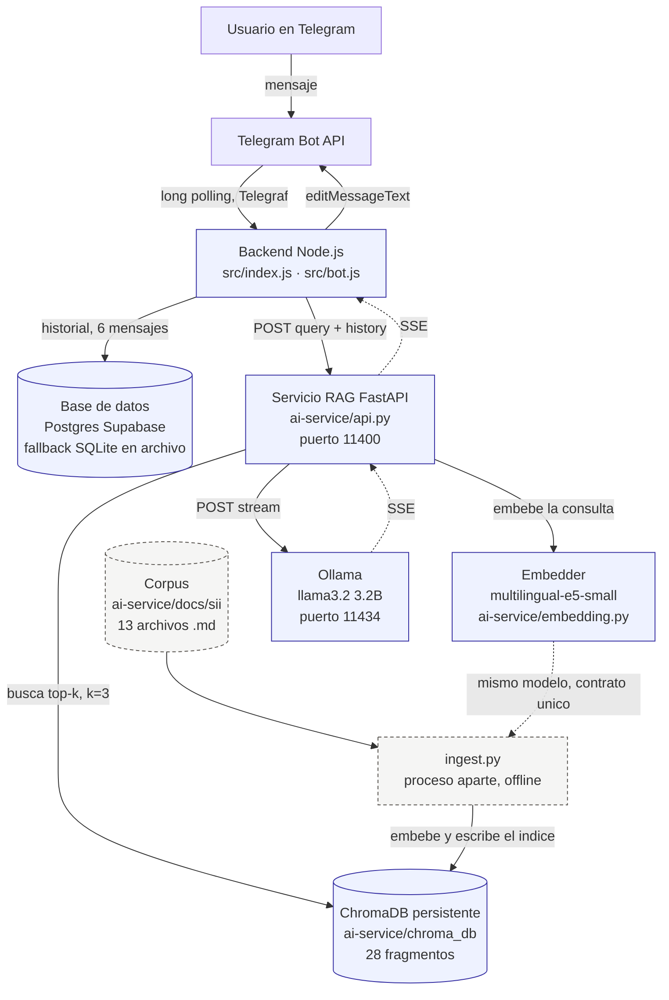
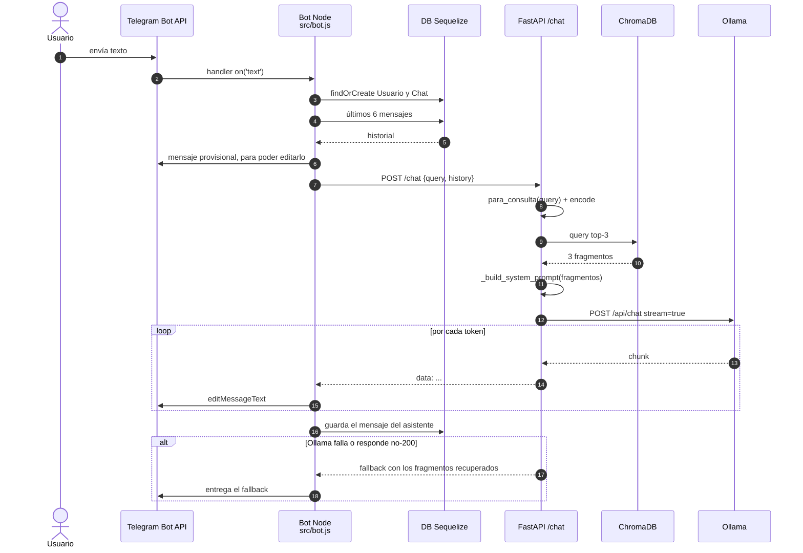
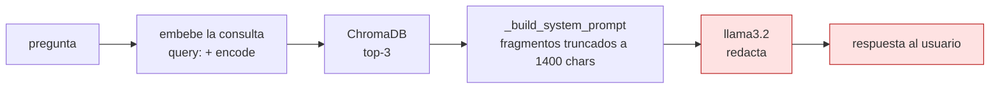
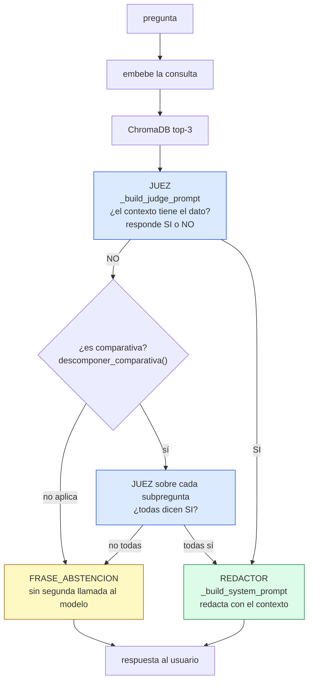
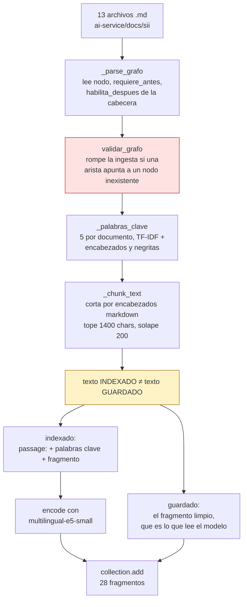

# Diagramas y especificación del sistema

**Última actualización:** 2026-09-27 · **Refleja:** `main` tras la iteración 1.16

> Los bloques son Mermaid y se renderizan en GitHub. La sección 5 repite la
> estructura como texto nodo a nodo, para recrear los diagramas en otra herramienta
> o para lectura por modelos.

> **⚠️ Lo más importante de este documento está en la sección 3.** Hay **dos**
> pipelines: el que corre en producción (un paso, alucina 34%) y el que se evaluó
> durante 16 iteraciones (dos pasos, 0% de alucinación). **No son el mismo**, y
> portar el segundo a producción es la deuda abierta del proyecto.

---

## 1. Arquitectura global

```mermaid
graph TD
  U["Usuario en Telegram"]
  TA["Telegram Bot API"]
  B["Backend Node.js<br/>src/index.js · src/bot.js"]
  DB[("Base de datos<br/>Postgres Supabase<br/>fallback SQLite en archivo")]
  RAG["Servicio RAG FastAPI<br/>ai-service/api.py<br/>puerto 11400"]
  EMB["Embedder<br/>multilingual-e5-small<br/>ai-service/embedding.py"]
  VEC[("ChromaDB persistente<br/>ai-service/chroma_db<br/>28 fragmentos")]
  DOCS[("Corpus<br/>ai-service/docs/sii<br/>13 archivos .md")]
  OLL["Ollama<br/>llama3.2 3.2B<br/>puerto 11434"]
  ING["ingest.py<br/>proceso aparte, offline"]

  U -->|mensaje| TA
  TA -->|long polling, Telegraf| B
  B -->|historial, 6 mensajes| DB
  B -->|POST query + history| RAG
  RAG -->|embebe la consulta| EMB
  RAG -->|busca top-k, k=3| VEC
  RAG -->|POST stream| OLL
  OLL -.->|SSE| RAG
  RAG -.->|SSE| B
  B -->|editMessageText| TA

  DOCS --> ING
  ING -->|embebe y escribe el indice| VEC
  EMB -.->|mismo modelo, contrato unico| ING

  classDef infra fill:#eef2ff,stroke:#3730a3
  classDef offline fill:#f5f5f4,stroke:#57534e,stroke-dasharray: 4 3
  class B,RAG,VEC,DB,OLL,EMB infra
  class ING,DOCS offline
```

**Lo que cambió respecto de la versión anterior de este documento:**

- El corpus se lee **solo** de `ai-service/docs/sii/`. No hay `docs/` en la raíz.
- **`ingest.py` es un proceso aparte y offline.** Antes el diagrama sugería que el
  servicio leía los `.md` en caliente; no lo hace: lee el índice ya construido.
- **Se eliminó el nodo de frontend.** No existe ningún directorio de frontend en el
  repositorio. Queda código muerto en `src/config/` y `src/graphql/`, que es deuda de
  limpieza, no un componente.
- **Se eliminó la flecha `ChromaDB → corpus`**, que no correspondía a nada: el índice
  no persiste hacia los documentos.

---

## 2. Ciclo de vida de un mensaje

```mermaid
sequenceDiagram
  autonumber
  actor U as Usuario
  participant TA as Telegram Bot API
  participant B as Bot Node<br/>src/bot.js
  participant DB as DB Sequelize
  participant RAG as FastAPI /chat
  participant VEC as ChromaDB
  participant OLL as Ollama

  U->>TA: envía texto
  TA->>B: handler on('text')
  B->>DB: findOrCreate Usuario y Chat
  B->>DB: últimos 6 mensajes
  DB-->>B: historial
  B->>TA: mensaje provisional, para poder editarlo
  B->>RAG: POST /chat {query, history}

  RAG->>RAG: para_consulta(query) + encode
  RAG->>VEC: query top-3
  VEC-->>RAG: 3 fragmentos
  RAG->>RAG: _build_system_prompt(fragmentos)
  RAG->>OLL: POST /api/chat stream=true

  loop por cada token
    OLL-->>RAG: chunk
    RAG-->>B: data: ...
    B->>TA: editMessageText
  end

  B->>DB: guarda el mensaje del asistente

  alt Ollama falla o responde no-200
    RAG-->>B: fallback con los fragmentos recuperados
    B->>TA: entrega el fallback
  end
```

**Nota sobre el fallback:** cuando Ollama falla, `api.py` devuelve **el contexto
recuperado en crudo**. Es un texto útil para depurar, pero **no es una respuesta
redactada**, y el bot lo envía tal cual al usuario. Está anotado como deuda.

---

## 3. Los dos pipelines: el que corre y el que se midió

Esta es la distinción central del proyecto y la razón de ser de su documentación.

### 3.1. Lo que corre en producción — un paso

```mermaid
flowchart LR
  Q["pregunta"] --> E["embebe la consulta<br/>query: + encode"]
  E --> S["ChromaDB<br/>top-3"]
  S --> P["_build_system_prompt<br/>fragmentos truncados a 1400 chars"]
  P --> L["llama3.2<br/>redacta"]
  L --> R["respuesta al usuario"]

  style L fill:#fee2e2,stroke:#b91c1c
  style R fill:#fee2e2,stroke:#b91c1c
```

**El modelo decide por sí mismo si el contexto alcanza, mientras redacta.** Medido
sobre el banco: **alucina en 17 de las 50 preguntas sin respaldo (34%)**.

### 3.2. Lo que se evaluó durante 16 iteraciones — dos pasos

```mermaid
flowchart TD
  Q["pregunta"] --> E["embebe la consulta"]
  E --> S["ChromaDB top-3"]
  S --> J["JUEZ<br/>_build_judge_prompt<br/>¿el contexto tiene el dato?<br/>responde SI o NO"]

  J -->|NO| D{"¿es comparativa?<br/>descomponer_comparativa()"}
  D -->|no aplica| AB["FRASE_ABSTENCION<br/>sin segunda llamada al modelo"]
  D -->|sí| SUB["JUEZ sobre cada subpregunta<br/>¿todas dicen SI?"]
  SUB -->|no todas| AB
  SUB -->|todas sí| W
  J -->|SI| W["REDACTOR<br/>_build_system_prompt<br/>redacta con el contexto"]

  W --> R["respuesta al usuario"]
  AB --> R

  style J fill:#dbeafe,stroke:#1d4ed8
  style W fill:#dcfce7,stroke:#15803d
  style AB fill:#fef9c3,stroke:#a16207
  style SUB fill:#dbeafe,stroke:#1d4ed8
```

**Medido:** alucinación **0/50**, sensibilidad 37/50, especificidad del juez 49/50.

Dos propiedades del diseño que el diagrama hace visibles:

- **El camino `NO` no llama al modelo:** devuelve la frase de abstención directo. Por
  eso el pipeline de dos pasos es **más rápido** que el de un paso cuando rechaza — 62
  de las 100 preguntas se resuelven con una sola llamada.
- **La descomposición solo cuelga del `NO`.** No puede convertir un `SI` en `NO`, y su
  costo recae únicamente en los casos que de otro modo se perderían. Y **el redactor
  recibe siempre la pregunta original**, nunca las subpreguntas.

> **Este pipeline vive en `scripts/evaluar_banco.py`, no en `api.py`.** Llevarlo a
> producción es el próximo paso del proyecto. Ver
> [`INFORME_INVESTIGACION.md`](INFORME_INVESTIGACION.md), sección 11.

---

## 4. Construcción del índice — `ingest.py`

```mermaid
flowchart TD
  MD["13 archivos .md<br/>ai-service/docs/sii"] --> G["_parse_grafo<br/>lee nodo, requiere_antes,<br/>habilita_despues de la cabecera"]
  G --> V["validar_grafo<br/>rompe la ingesta si una<br/>arista apunta a un nodo inexistente"]
  V --> K["_palabras_clave<br/>5 por documento, TF-IDF +<br/>encabezados y negritas"]
  K --> C["_chunk_text<br/>corta por encabezados markdown<br/>tope 1400 chars, solape 200"]
  C --> T["texto INDEXADO ≠ texto GUARDADO"]
  T --> I["indexado:<br/>passage: + palabras clave + fragmento"]
  T --> A["guardado:<br/>el fragmento limpio,<br/>que es lo que lee el modelo"]
  I --> EMB["encode con<br/>multilingual-e5-small"]
  EMB --> COL["collection.add<br/>28 fragmentos"]
  A --> COL

  style T fill:#fef3c7,stroke:#a16207
  style V fill:#fee2e2,stroke:#b91c1c
```

**Tres cosas que este diagrama corrige de la versión anterior:**

- El chunking es **1400 / 200**, no 800 / 150. Cambió en la iteración 1.1, y la 1.15
  confirmó por barrido que 1400/200 es el óptimo.
- **El embedder es `multilingual-e5-small`**, definido en un único lugar
  (`ai-service/embedding.py`). La versión anterior decía *"OllamaEmbeddings o
  Sentence-Transformers"*: esa ambigüedad era real y causó un incidente, porque
  `ingest.py` intentaba `nomic-embed-text` (768 dims) con respaldo silencioso a un
  modelo de 384.
- **El texto que se indexa no es el que se guarda.** El indexado lleva delante el
  prefijo `passage:` y las palabras clave del documento; el guardado es el fragmento
  limpio. Así el vocabulario trabaja en el recuperador sin meter ruido en el contexto
  que lee el modelo.

**`validar_grafo` rompe la ingesta a propósito** si una arista apunta a un nodo que
ningún documento declara. Un grafo con aristas colgantes degrada en silencio.

---

## 5. Especificación nodo a nodo

### Usuario en Telegram
Origen de la consulta. Envía texto.

### Telegram Bot API
Transporte. `src/bot.js` usa **Telegraf** con *long polling*.

### Backend Node.js — `src/index.js`, `src/bot.js`
- Recibe mensajes, persiste historial, llama al servicio RAG y muestra la respuesta
  editando un mensaje provisional (`editMessageText`) para simular *streaming*.
- Envía las **últimas 6** interacciones como historial (`HISTORY_LIMIT = 6`).
- Apunta a `RAG_URL`, por defecto `http://localhost:11400/chat`.
- Ante un error de base de datos **continúa sin historial**.

### Base de datos — Sequelize
- Modelos: `Usuario`, `Chat`, `Mensaje`.
- Postgres (Supabase) con **fallback a SQLite en archivo** (`./data/dev.sqlite`).
- Antes el fallback era SQLite *en memoria* y se perdía el contexto en cada reinicio.

### Servicio RAG — `ai-service/api.py`, puerto 11400
- Embebe la consulta, recupera `k=3` de ChromaDB, construye el prompt y consulta a
  Ollama por *streaming*.
- Globales inicializados en el arranque: `_st_model`, `_chroma_client`, `_collection`.
- **Sirve `/chat` de un paso.** El juez y la descomposición están definidos acá
  (`_build_judge_prompt`, `descomponer_comparativa`) pero **`/chat` no los usa**: los
  usa el arnés de evaluación.

### Contrato del embedder — `ai-service/embedding.py`
- Define `MODEL_NAME` y los prefijos `query:` / `passage:` de la familia E5.
- **Es el único lugar donde vive el nombre del modelo.** `ingest.py`, `api.py` y los
  cinco scripts de medición lo importan. Antes estaba escrito a mano en siete
  archivos.

### ChromaDB — `ai-service/chroma_db/`
- Colección `sii_markdown`, 28 fragmentos, 384 dimensiones.
- Métrica: **L2 por defecto**. Es indistinto del coseno porque el modelo normaliza los
  vectores: verificado, top-6 idéntico en 50 de 50 preguntas.
- **No está versionado.** Tras cualquier `pull` hay que correr `python ingest.py`.

### Corpus — `ai-service/docs/sii/`
13 archivos `.md`, 26.245 caracteres, elaboración propia. Cada uno puede declarar una
cabecera de grafo (`Nodo:`, `Requiere antes:`, `Habilita después:`).

### Ollama — puerto 11434
- `llama3.2` (3,2B) como **juez y como redactor**.
- Parámetros: `temperature=0.0`, `top_p=0.1`, `num_ctx=4096`, `num_predict=300`
  (5 para el juez, que solo responde `SI` o `NO`).

---

## 6. Deuda visible en los diagramas

| # | Qué | Dónde |
|---|---|---|
| 1 | **El pipeline de dos pasos no está en producción.** `/chat` sirve el de un paso, que alucina 34% | sección 3 |
| 2 | El fallback ante fallo de Ollama envía **el contexto en crudo** al usuario, no una respuesta | sección 2 |
| 3 | Código muerto en `src/config/` y `src/graphql/`, del proyecto anterior | sección 1 |
| 4 | Sin reintentos ni *circuit breaker* hacia Ollama | sección 1 |

La lista completa y priorizada está en [`CONTEXTO.md`](CONTEXTO.md), sección 7.
