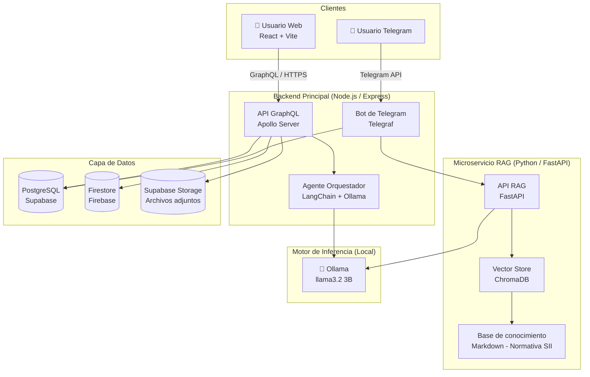
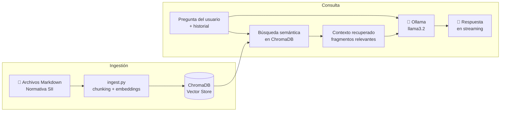
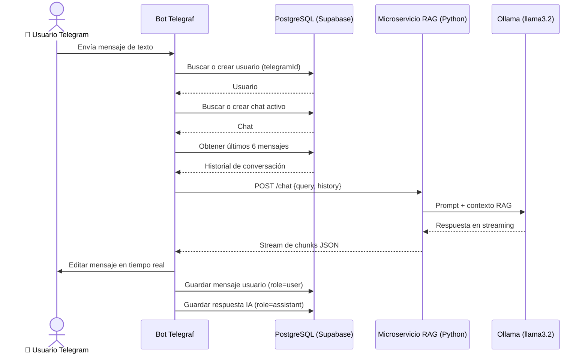

# 1. Desarrollo del proyecto

Para el desarrollo de este proyecto se atravesó un largo proceso iterativo, tanto de análisis como de diseño. Esto no respondió a una intención previa, sino que fue surgiendo a partir de la información que se fue recabando durante el proceso. Al estar profundamente interesados en el mundo del emprendimiento, pudimos percibir distintas perspectivas y necesidades que presentan los emprendedores. A lo largo del proyecto se produjeron numerosos cambios de paradigma y cuestionamientos que, desde una mirada de ingeniería, fueron acogidos con rapidez y resueltos con adaptabilidad. Esta mentalidad ágil fue la que nos permitió llegar donde estamos hoy.

El proyecto pasó por múltiples transformaciones: partió con el objetivo de *"Desarrollar una aplicación digital que apoye a emprendedores en etapa temprana mediante herramientas de organización, validación de productos y metodologías de trabajo, con el fin de mejorar su gestión empresarial, facilitar la toma de decisiones y contribuir a la superación del 'valle de la muerte'."* Sin embargo, este objetivo resultó demasiado ambicioso y no resolvía un problema específico. A través de una matriz de esfuerzo e impacto, se identificó que el proyecto anterior implicaba un esfuerzo elevado con un impacto solo mediano, tal como se aprecia en la Figura 5\_1.

> **Figura 5\_1:** Matriz de esfuerzo y beneficio.
> *Referencia: Creada por los autores.*

---

## 1.1. Análisis

En cuanto al análisis, el proyecto partió investigando la alta tasa de mortalidad empresarial durante los primeros tres años operativos, fenómeno que se debe, en gran medida, al denominado *"valle de la muerte"*: el período en que los ingresos operativos no alcanzan a cubrir los requerimientos de capital (Antón, 2021). Con esta premisa, la investigación buscaba responder la siguiente pregunta: **¿Qué provoca el valle de la muerte?** El proceso investigativo permitió identificar cuatro factores que contribuyen a la muerte temprana de las Mipymes: la falta de financiamiento, la deficiente gestión y validación del producto, la baja adopción tecnológica y, finalmente, la intensa competencia agravada por la alta informalidad.

¿Por qué esta idea se desechó? Además de los resultados de la matriz de esfuerzo e impacto, se tuvo la oportunidad de conversar con emprendedores, dueños de Fintech y fundadores de startups. En esas conversaciones emergió una idea que revolucionó el enfoque del proyecto: *"estamos viviendo un cambio de paradigma; la IA ya está logrando eliminar el valle de la muerte"*.

A partir de esta nueva perspectiva se iteró y se evaluaron nuevas propuestas. La pregunta central se transformó en **¿cómo democratizamos la IA?** No se tenía del todo claro cómo lograrlo, pero sí había certeza de que la tecnología y la información estaban disponibles. En ese punto de incertidumbre, el profesor guía Pablo Schwarzenberg mencionó la complejidad y lo engorroso de los procesos dentro del Servicio de Impuestos Internos (SII). Esta información, sumada a los hallazgos previos —particularmente el factor de *"intensa competencia, agravada por la alta informalidad"*— fue el punto de partida que llevó al equipo a su enfoque actual.

Ya se sabía que la informalidad era un problema tanto para los emprendedores como para el Estado, pero no se dimensionaba su magnitud, dado que no había sido el foco principal en un inicio. A partir de ese momento comenzó una investigación exhaustiva, que dejó en evidencia que esta problemática es real e impacta en la vida de todos los chilenos: un emprendedor que opera en la informalidad es un emprendedor que no contribuye tributariamente y que se encuentra desprotegido ante las autoridades.

En este punto surgieron cuestionamientos que resultaron relativamente sencillos de responder, tales como *¿realmente es un problema?*, *¿existe información suficiente?* y *¿se desarrolló algo similar antes?*, entre otros. Todas las preguntas estuvieron al alcance del equipo: el INE y otras entidades cuentan con los índices necesarios para evidenciar la magnitud del problema; el SII dispone de toda la documentación requerida; y con el apoyo de herramientas de IA como Gemini, la investigación de soluciones similares existentes fue ágil y eficiente. En definitiva, una vez que se estableció un objetivo claro, la investigación avanzó de manera notable y el equipo logró sumergirse en una problemática concreta y con impacto real.

---

## 1.2. Diseño

En cuanto al diseño, el trabajo comenzó en paralelo con la reformulación del objetivo. La primera decisión de diseño fue la construcción del diagrama de la base de datos (BD), que se muestra en la Figura 5.2\_1. Desde el principio se sabía que el sistema incluiría un chatbot que necesitaría almacenar el contexto de los usuarios y el historial de mensajes, por lo que la BD era una definición fundacional. Para su creación e implementación se utilizó **Supabase**, herramienta ya conocida por el equipo que ofrece una BD pequeña, conectada a la nube y con altos estándares de seguridad.

> **Figura 5.2\_1:** Diagrama de base de datos.
> *Referencia: Creada por los autores.*

Con esa estructura definida, se procedió a diseñar la arquitectura de la IA. Se optó inicialmente por **Ollama** por familiaridad con la herramienta, y se comenzaron a realizar pruebas con distintos modelos pre-entrenados. A continuación se presenta la tabla comparativa que orientó la decisión (Figura 5.2\_2):

| **Modelo** | **Tamaño de Parámetros** | **Ventana de Contexto (Nativa)** | **Uso de RAM Mínimo** | **Velocidad** |
|---|---|---|---|---|
| llama2 | 7 Billones | 4.096 tokens (~4K) | ~8 GB RAM (modelo ~3,8 GB) | Moderada |
| llama3 | 8 Billones | 8.192 tokens (~8K) | ~8 a 16 GB RAM (modelo ~4,7 GB) | Rápida |
| llama3.1 | 8 Billones | 128.000 tokens (~128K) | ~8 a 16 GB RAM (modelo ~4,9 GB) | Rápida |
| llama3.2 | 3 Billones | 128.000 tokens (~128K) | ~4 GB RAM (modelo ~2,0 GB) | Extremadamente rápida |

> **Figura 5.2\_2:** Tabla de comparación de modelos LLM.
> *Referencia: Creada por los autores.*

Se optó por el modelo **llama3.2** por ser el más eficiente en términos de recursos: con apenas 3 billones de parámetros logra una ventana de contexto de 128K tokens con un uso de RAM de aproximadamente 4 GB, lo que lo hace viable para ser ejecutado localmente. A continuación se construyó la estructura agéntica del sistema y se comenzó a organizar la información de referencia en archivos Markdown, los cuales servirían de base de conocimiento para las primeras pruebas con los modelos. En paralelo, se inició la construcción del backend en **Node.js**, capaz de conectarse con un frontend web. Una vez levantado el backend, las conexiones con los distintos servicios —Supabase, Firebase y Ollama— se establecieron sin inconvenientes, lo que permitió avanzar rápidamente hacia la fase de desarrollo.

---

## 1.3. Desarrollo

### 1.3.1. Arquitectura general del sistema

El sistema *Emprende* está compuesto por cuatro grandes bloques que operan de forma coordinada: el **frontend web**, el **backend principal** (Node.js), el **microservicio de RAG** (Python) y la **capa de datos** (bases de datos relacionales y no relacionales). Adicionalmente, el sistema expone un canal de interacción a través de un **bot de Telegram**, que constituye el medio principal de acceso para los usuarios. La relación entre estos componentes se ilustra en la Figura 5.3\_1.

> **Figura 5.3\_1:** Diagrama de arquitectura general del sistema.
> *Referencia: Creada por los autores.*

---

### 1.3.2. Backend principal (Node.js)

El backend fue desarrollado con **Node.js** y el framework **Express 5**, utilizando **GraphQL** como protocolo de comunicación con el frontend web, implementado mediante **Apollo Server**. Esta elección permite que el cliente solicite exactamente los datos que necesita, reduciendo el sobre-fetching y haciendo la API más flexible y mantenible.

La estructura del backend se organiza en los siguientes módulos:

- **`src/graphql/`**: Define el esquema GraphQL con los tipos, queries y mutaciones del sistema. Las operaciones principales incluyen la gestión de usuarios (`addUsuario`, `loginEmailPassword`), conversaciones (`addChat`, `getChatsByUsuarioID`) y mensajes (`addMensaje`, `procesarMensajeConIA`).
- **`src/models/`**: Contiene los modelos Sequelize que mapean las entidades del negocio a la base de datos relacional.
- **`src/config/`**: Centraliza las conexiones a servicios externos: Supabase, Firebase Admin SDK y Firestore.
- **`src/validations/`**: Implementa validaciones con **Joi** para garantizar la integridad de los datos en cada operación.

La integración con el motor de lenguaje se realiza a través de **LangChain**, que actúa como capa de orquestación entre el backend y Ollama. Al recibir un mensaje del usuario, el sistema recupera el historial reciente de la conversación desde Firestore, construye el contexto y lo envía al agente orquestador, que consulta al modelo llama3.2 a través de Ollama para generar la respuesta. Tanto el mensaje del usuario como la respuesta de la IA se persisten en Firestore.

La autenticación del sistema se implementa con **Firebase Authentication**: el frontend obtiene un token JWT al iniciar sesión, que es enviado en el encabezado de cada petición GraphQL. El backend verifica dicho token con el Firebase Admin SDK antes de procesar cualquier operación.

---

### 1.3.3. Microservicio RAG (Python / FastAPI)

La capacidad de responder preguntas sobre normativas del SII y procesos de formalización se implementó mediante un microservicio de **Recuperación Aumentada de Generación (RAG)**, desarrollado en Python con **FastAPI**.

Este microservicio opera de forma independiente del backend Node.js y se comunica con él a través de llamadas HTTP internas. Su arquitectura interna funciona de la siguiente manera:

1. **Ingestión de documentos**: Un script (`ingest.py`) procesa los archivos Markdown que contienen información estructurada sobre normativas del SII, el proceso de inicio de actividades, formularios y trámites tributarios. Cada documento es dividido en fragmentos (*chunks*), codificado mediante **Sentence Transformers** y almacenado en **ChromaDB**, una base de datos vectorial que permite búsquedas semánticas eficientes.

2. **Consulta RAG**: Cuando el sistema recibe una pregunta del usuario, el microservicio realiza una búsqueda semántica en ChromaDB para recuperar los fragmentos más relevantes de la base de conocimiento. Estos fragmentos, junto con la pregunta y el historial de conversación, son enviados al modelo **llama3.2** (a través de Ollama) para generar una respuesta contextualizada y fundamentada.

3. **Respuesta en streaming**: La respuesta es devuelta en modo *streaming*, lo que permite que tanto el bot de Telegram como el frontend comiencen a mostrar el texto al usuario de forma progresiva, mejorando la experiencia de usuario percibida.

> **Figura 5.3\_2:** Flujo del microservicio RAG.
> *Referencia: Creada por los autores.*

---

### 1.3.4. Bot de Telegram

El bot de Telegram representa el canal principal de interacción con el usuario. Fue implementado con la librería **Telegraf** y opera en paralelo al servidor HTTP, como un proceso autónomo dentro de la misma aplicación Node.js.

El flujo de interacción funciona de la siguiente manera (Figura 5.3\_3):

1. El usuario envía un mensaje al bot en Telegram.
2. El bot verifica si el usuario ya existe en la base de datos mediante su `telegramId`. En caso contrario, crea un nuevo registro de usuario automáticamente.
3. Se recupera o crea la conversación activa del usuario en PostgreSQL.
4. Se obtienen los últimos seis mensajes del historial para construir el contexto.
5. El mensaje y el contexto son enviados al microservicio RAG mediante una petición HTTP.
6. La respuesta llega en formato *streaming* y el bot la va editando en tiempo real en Telegram, mostrando al usuario el texto a medida que se genera.
7. Tanto el mensaje del usuario como la respuesta de la IA se persisten en PostgreSQL.

> **Figura 5.3\_3:** Flujo de interacción del bot de Telegram.
> *Referencia: Creada por los autores.*

---

### 1.3.5. Frontend web (React)

El frontend fue desarrollado con **React 19** y **Vite** como herramienta de construcción, utilizando **Tailwind CSS** para los estilos. La comunicación con el backend se realiza exclusivamente a través de **Apollo Client**, que gestiona las peticiones GraphQL e inyecta automáticamente el token de autenticación de Firebase en cada solicitud.

La aplicación se estructura en los siguientes componentes principales:

- **`Login.tsx`**: Página de autenticación con soporte para registro e inicio de sesión mediante Firebase (correo y contraseña). Sincroniza al usuario con la base de datos del backend al autenticarse.
- **`App.jsx`**: Contenedor principal de la aplicación autenticada. Gestiona el estado global de conversaciones, el perfil del usuario y la sesión activa.
- **`Sidebar.jsx`**: Panel lateral con el historial de conversaciones y botones de acceso rápido para las consultas más frecuentes (*"Mi primer sueldo"*, *"Mi primera inversión"*, *"Cómo formalizar mi negocio"*, entre otros).
- **`Chat.jsx`**: Componente central de conversación, con soporte para envío de texto, adjuntos (hasta 8 MB), renderizado de respuestas en **Markdown** e indicador de escritura animado mientras la IA procesa la consulta.
- **`ProfileModal.jsx`**: Modal para que el usuario edite su información personal relevante para el sistema (profesión, ciudad, ingresos, porcentaje de RSH).

---

### 1.3.6. Capa de datos

El sistema utiliza una arquitectura de almacenamiento híbrida, combinando tres servicios distintos según el tipo de dato:

| Servicio | Motor | Uso principal |
|---|---|---|
| **Supabase** | PostgreSQL | Usuarios, chats, metadatos de mensajes |
| **Firebase** | Firestore (NoSQL) | Contenido de los mensajes en tiempo real |
| **Supabase Storage** | Almacenamiento en la nube | Archivos adjuntos enviados por el usuario |

Esta separación responde a las distintas necesidades del sistema: PostgreSQL garantiza la integridad relacional de los datos estructurados; Firestore ofrece flexibilidad y velocidad para el acceso en tiempo real al contenido de los mensajes; y Supabase Storage provee un sistema de archivos en la nube para los adjuntos, accesibles mediante URL pública.

---

### 1.3.7. Despliegue e infraestructura

El sistema fue diseñado para operar con todos sus componentes de forma local durante el desarrollo. El esquema de despliegue contempla los siguientes servicios:

- **Backend Node.js**: Desplegado en **Render.com** (configuración incluida en `render.yaml`).
- **Frontend React**: Desplegado en **Firebase Hosting** (configuración incluida en `firebase.json`).
- **Microservicio RAG (Python)**: Ejecutado localmente junto a Ollama.
- **Ollama / llama3.2**: Motor de inferencia ejecutado localmente; el backend lo consume a través de la URL `http://127.0.0.1:11434`.
- **Supabase**: Base de datos PostgreSQL y almacenamiento en la nube gestionados íntegramente en la plataforma de Supabase (región `us-east-1`, AWS).
- **Firebase**: Autenticación y Firestore gestionados en la consola de Firebase.
